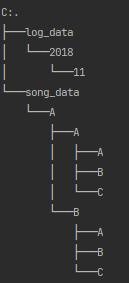
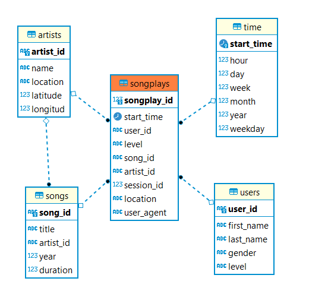

Sparkify
==============================
[](https://github.com/psf/black)

Code for project: Sparkify, Udacity

- Origin: (https://github.com/HeberTU/Sparkify)
- Author: Heber Trujillo <heber.trj.urt@gmail.com>
- Date of last README.md update: 16.02.2022

## Project Overview

### Motivation

A startup called Sparkify wants to analyze the data they've been collecting on songs and user activity 
on their new music streaming app. The analytics team is particularly interested in understanding what
songs users are listening to. Currently, they don't have an easy way to query their data, which resides 
in a directory of JSON logs on user activity on the app, as well as a directory with JSON metadata on the 
songs in their app.

This project aims to show Python capabilities for data modeling and ETL pipelines design using Postgres.

Mainly, this project will focus on:

* Define fact and dimension tables under the star schema optimized for OLAP.
* ETL pipeline design to transfer data from two local directories to a Postgres Data Base.

## How to Run Scripts 

### Dependencies Installation 

1. Create and activate a virtual environment for the project. For example:
    ```bash
    python3 -m venv ./.venv
    ./.venv/Scripts/activate
    ```
   
2. Install Poetry, the tool used for dependency management. To install it, run from a terminal:
    ```bash
    pip install poetry
    ```

3. From the virtual environment, install the required dependencies with
    ```bash
    poetry install --no-root
    ```

### Scripts

The project is structured as follows:

* sql_queries.py: A Script containing all the hardcode queries; future versions will refactor this using an ORM.

* create_tables.py: This drops and creates the DDBB Schema shown in the following section; future versions will use alembic.

* etl.py: Extract, process, and load the data from the `./data` directory to the Sparkify Data Base.

Hence, to process the JSON files, you have to run the following comands at the terminal:

```bash
python .\create_tables.py
python .\etl.py
```

## Data

The available data consists of:

* Song data: A subset of actual data from the Million Song Dataset. Each file is in JSON format and contains metadata 
* about a song and the artist. 

* Log Dataset: log files in JSON format generated by this event simulator based on the songs in the dataset 
above. These simulate activity logs from a music streaming app based on specified configurations.

   
`.\data\ tree`



## DataBase Schema

We use the star schema optimized to analyze which songs users are listening to, where we have:

* Fact Table
  * songplays - records in log data associated with song plays i.e. records with page NextSong.
  
* Dimension Tables
  * users - users in the app user_id, first_name, last_name, gender, level
  * songs - songs in music database song_id, title, artist_id, year, duration
  * artists - artists in music database.
  * time - timestamps of records in songplays broken down into specific units.

